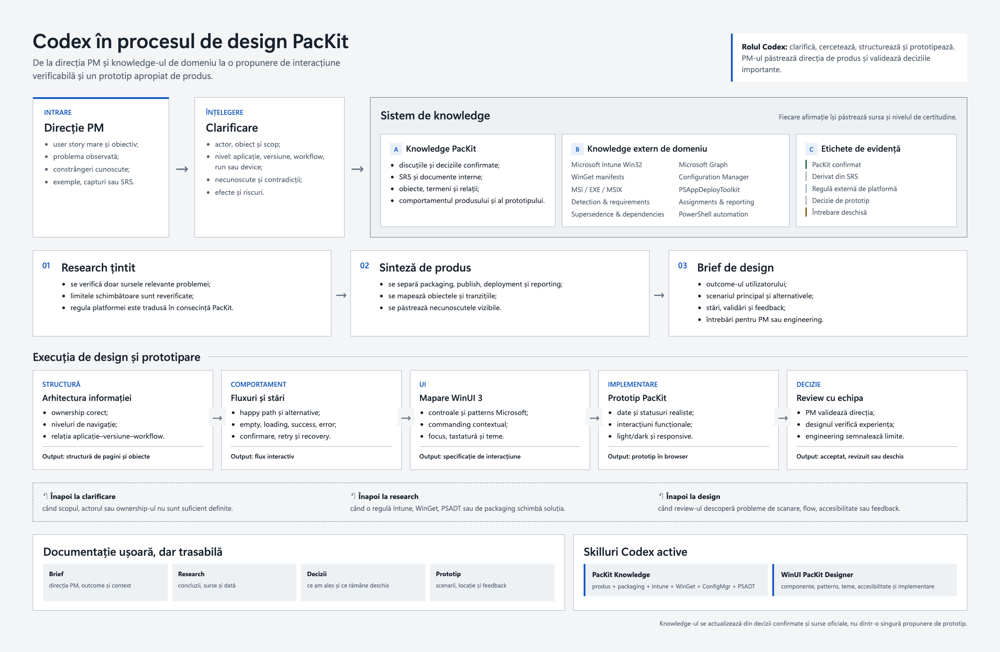

# Codex in procesul de design PacKit

Codex sustine procesul de design pornind de la directia oferita de PM. Nu stabileste strategia produsului si nu inlocuieste deciziile de product management.



## Procesul de lucru

1. **Directie PM**
   Primim un user story mare, obiectivul urmarit si contextul disponibil.

2. **Clarificare**
   Codex identifica intrebarile, necunoscutele, contradictiile si scenariile care trebuie explicate.

3. **Research si knowledge**
   Cerinta este analizata prin doua straturi distincte:

   - **Knowledge PacKit**: discutii confirmate, SRS, obiecte, termeni, procese si comportamente cunoscute;
   - **knowledge extern de domeniu**: Intune, Microsoft Graph, WinGet, Configuration Manager, MSI/EXE/MSIX, PowerShell si PSAppDeployToolkit.

   Informatiile sunt etichetate drept PacKit confirmat, derivat din SRS, regula externa de platforma, decizie de prototip sau intrebare deschisa.

4. **Design de interactiuni**
   Cerinta este transformata in fluxuri, pagini, stari, actiuni si componente WinUI 3. Wireframe-ul este optional si se foloseste cand descrierea nu clarifica suficient structura.

5. **Prototip PacKit**
   Se implementeaza un prototip functional cu date realiste, stari relevante si comportament apropiat de produs.

6. **Review**
   PM-ul, designul si echipa verifica directia. Feedback-ul poate trimite procesul inapoi la clarificare, research sau design.

## Documentatie minima pentru fiecare initiativa

Fiecare initiativa poate fi documentata intr-un singur fisier scurt care contine:

- user story si obiectivul transmis de PM;
- intrebari si necunoscute;
- concluzii relevante din research;
- fluxul principal si starile importante;
- deciziile de design luate;
- linkul sau locatia prototipului;
- feedback-ul primit si modificarile rezultate;
- intrebari ramase deschise.

## Checklist de finalizare a designului

Acest checklist se refera numai la design si prototip, nu la validarea strategiei sau a scope-ului produsului.

- scenariul principal poate fi parcurs in prototip;
- navigatia si actiunile sunt coerente cu PacKit;
- starile relevante sunt reprezentate: rest, hover, focus, selected, disabled, loading, empty, success si error, unde se aplica;
- componentele respecta comportamentul WinUI 3;
- continutul si datele sunt suficient de realiste pentru review;
- light theme si dark theme sunt verificate;
- contrastul, tastatura, focusul si denumirile accesibile sunt verificate;
- feedback-ul primit a fost aplicat sau documentat;
- intrebarile nerezolvate sunt vizibile si nu sunt prezentate drept decizii.

## Dezvoltarea skillurilor Codex

Un skill nou se creeaza numai cand apare o nevoie repetitiva. Pentru o problema izolata este suficienta documentatia initiativei.

Setul initial activ este:

- **WinUI PacKit Designer** pentru componente, interactiuni, accesibilitate si teme;
- **PacKit Knowledge** pentru modelul produsului si domeniile packaging, Intune, Configuration Manager, WinGet, PowerShell si PSAppDeployToolkit.

Un skill separat de Prototype Validator nu este necesar momentan. Verificarile relevante raman parte din procesul normal de implementare si review al prototipului.

Skillurile se actualizeaza pe baza patternurilor confirmate in review-uri, nu pe baza unei singure propuneri de design.

## Structura usoara a fisierelor

```text
docs/design/
|-- codex-design-process.md
|-- codex-packit-design-process.png
|-- codex-packit-design-process.html
|-- initiatives/
|   `-- <initiative-name>.md
`-- shared/
    |-- packit-context.md
    |-- interaction-patterns.md
    `-- skill-catalog.md
```

Structura poate ramane compacta. Fisiere separate sunt necesare numai cand volumul de informatie sau numarul de initiative incepe sa faca documentele greu de parcurs.
